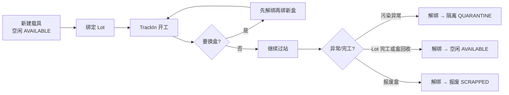

# 载具作业 — 一页流程

> 适用：MES 薄 Carrier（台账 + 绑解 + TrackIn 闸）  
> 口径：称「TrackIn 载具闸」，不称 Carrier Management  
> 入口：Admin「载具台账」`/app/carrier` · Lot 抽屉「载具」· 现场 Track「载具」

## 三句话纪律

1. **一 Lot 只能绑一个盒；一盒同时只能挂一个 Lot。**
2. **换盒必须先解绑再绑，禁止静默抢绑。**
3. **试点线开闸后：未绑不能开工；其它线闸关时仍可按纪律先绑再过。**

## 谁做什么

| 角色 | 做什么 | 权限 |
|------|--------|------|
| 工艺/制造工程 | 建盒、改态（隔离/报废）、开闸策略 | `carrier:edit` + 配置 |
| 班组 / 操作员 | 绑、解、过站看载具码 | `carrier:bind` / `carrier:view` |
| IT | 开关 `mes.carrier.track-in-required`、回滚 | 配置发布 |

## 系统落点（对照界面）

| 动作 | 在哪点 |
|------|--------|
| 建盒 | `/app/carrier` →「新建载具」 |
| 绑/解（盒侧） | 载具详情抽屉 →「绑定 / 解绑」 |
| 绑/解（批侧） | `/app/lots` 详情 →「载具」区 |
| 看是否已绑 | Track 现场台 Lot 信息「载具」列 |
| 开闸拒进站 | Track「Track In / 开工」；提示：须先绑定载具 |

配套：`WI-Carrier-01` 正常作业 · `WI-Carrier-02` 异常与开闸检查表
